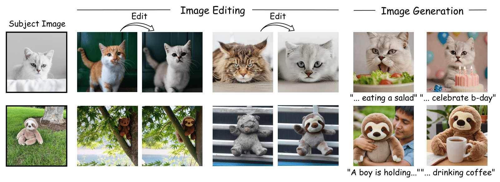

# Single Image Iterative Subject-driven Generation and Editing

> **Yair Shpitzer, Gal Chechik, Idan Schwartz**
>
> Personalizing image generation and editing is particularly challenging when we only have a few images of the subject, or even a single image. A common approach to personalization is concept learning, which can integrate the subject into existing models relatively quickly, but produces images whose quality tends to deteriorate quickly when the number of subject images is small. Quality can be improved by pre-training an encoder, but training restricts generation to the training distribution, and is time consuming. It is still an open hard challenge to personalize image generation and editing from a single image without training. Here, we present SISO, a novel, training-free approach based on optimizing a similarity score with an input subject image. More specifically, SISO iteratively generates images and optimizes the model based on loss of similarity with the given subject image until a satisfactory level of similarity is achieved, allowing plug-and-play optimization to any image generator. We evaluated SISO in two tasks, image editing and image generation, using a diverse data set of personal subjects, and demonstrate significant improvements over existing methods in image quality, subject fidelity, and background preservation. 

<a href="https://siso-paper.github.io/"></a> 

<a href="https://arxiv.org/abs/2503.16025"></a>

<p align="center">

</p>

## Description

Official implementation of *Single Image Iterative Subject-driven Generation and Editing*.

**Note:** This is a fork modified to improve compatibility with different hardware accelerators, including Intel XPU via IPEX, by removing hardcoded CUDA references and refactoring some dependencies.

## Setup

1.  **Clone Repository:**
    ```bash
    # Replace <your-fork-url> with the actual URL of this repository
    git clone <your-fork-url> SISO-Fork
    cd SISO-Fork
    ```

2.  **Prepare Python Environment:**
    *   Ensure you have a Python environment (3.10+ recommended) ready. This could be a virtual environment (venv) or a conda environment.
    *   **Activate** the environment you intend to use for SISO (and potentially ComfyUI if sharing the environment).

3.  **Install Dependencies:**
    *   Install the core Python packages:
        ```bash
        pip install -r requirements.txt
        ```
    *   Install the required `open_clip` dependencies via editable install:
        ```bash
        pip install -e third_party/IR_dependencies/open_clip_280
        pip install -e third_party/IR_dependencies/open_clip_280_overlap
        ```
    *   *(Optional but Recommended)* Verify installation, paying attention to any version warnings, especially for `torch`, `diffusers`, etc.

4.  **Download IR Weights:**
    *   Download the `ir_features.pth` file from the source specified in the original SISO project (e.g., [Kaggle Link](https://www.kaggle.com/datasets/louieshao/guieweights0732?resource=download)).
    *   Create a directory `models/ir_weights/` within the cloned `SISO-Fork` repository.
    *   Place the downloaded `ir_features.pth` file inside `SISO-Fork/models/ir_weights/`.

5.  **Device Setup (CUDA/XPU/CPU):**
    *   The scripts in this fork attempt to auto-detect the available accelerator (XPU > CUDA > CPU).
    *   Ensure your environment is correctly configured (CUDA toolkit installed, or Intel® Extension for PyTorch* (IPEX) installed for XPU).
    *   You may need to configure `accelerate` via `accelerate config` for multi-GPU or specific setups.

## Run SISO (Command Line)

### FLUX
```
python siso_generation_flux.py --subject_image_path example_images/dog_subject.png --prompt a\ photo\ of\ a\ dog --train_text_encoder --output_dir logs/dog_generation --lr_warmup_steps 0 --lr_scheduler constant --train_batch_size 1 --resolution 512 --pretrained_model_name_or_path black-forest-labs/FLUX.1-schnell  --num_train_epochs 50 --early_stopping_threshold_percentage 3 --early_stopping_max_count 7 --num_inference_steps 1 --learning_rate 2e-4 --seed=42 --save_weights --weights_output_dir weights/dog --ir_features_path <path_to_IR_weights> --mixed_precision bf16

# use the optimized weights for different prompts
python inference_prompt_simplification.py --model_name black-forest-labs/FLUX.1-schnell --lora_weights_path <path/to/weights> --num_inference_steps 4 --prompt "a dog in the park" --guidance_scale 0.0 --output_path <path/to/output> --seed 42

```

### SDXL

```
python siso_generation_flux.py --subject_image_path example_images/dog_subject.png --prompt a\ photo\ of\ a\ dog --train_text_encoder --output_dir logs/dog_generation --lr_warmup_steps 0 --lr_scheduler constant --train_batch_size 1 --resolution 512 --pretrained_model_name_or_path stabilityai/sdxl-turbo --num_train_epochs 50 --early_stopping_threshold_percentage 3 --early_stopping_max_count 7 --num_inference_steps 1 --learning_rate 2e-4 --seed=42 --save_weights --weights_output_dir weights/dog --ir_features_path <path_to_IR_weights>

# use the optimized weights for different prompts
python inference_prompt_simplification.py --model_name black-forest-labs/FLUX.1-schnell --lora_weights_path </path/to/weights> --num_inference_steps 4 --prompt "a dog in the park" --guidance_scale 0.0 --output_path </path/to/output> --seed 42
```

### Sana

```
python siso_generation_sana.py --subject_image_path example_images/dog_subject.png --prompt a\ photo\ of\ a\ dog --output_dir logs/dog_generation --lr_warmup_steps 0 --lr_scheduler constant --train_batch_size 1 --resolution 512 --pretrained_model_name_or_path Efficient-Large-Model/Sana_1600M_512px_diffusers  --num_train_epochs 50 --early_stopping_threshold_percentage 3 --early_stopping_max_count 5 --num_inference_steps 20 --learning_rate 8e-4 --seed=42 --save_weights --weights_output_dir weights/dog --ir_features_path <path_to_IR_weights>  --num_grad_steps 3 


# use the optimized weights for different prompts
python inference_prompt_simplification.py --model_name Efficient-Large-Model/Sana_1600M_512px_diffusers  --lora_weights_path </path/to/weights> --num_inference_steps 20 --prompt "a dog in the park" --guidance_scale 4.5 --output_path </path/to/output> --seed 42
```


## Run SISO for Editing

### SDXL

```
 python siso_editing_sdxl.py --output_dir logs/dog_editing --seed=42 --lr_warmup_steps 0 --lr_scheduler constant --learning_rate 3e-4 --train_batch_size 1 --resolution 512 --pretrained_model_name_or_path stabilityai/sdxl-turbo --num_train_epochs 50 --bg_mse_loss_weight 10. --ir_features_weight 1.0 --dino_features_weight 1.0 --early_stopping_threshold_percentage 3 --early_stopping_max_count 7 --input_image_path example_images/dog_input.png --subject_image_path example_images/dog_subject.png --ir_features_path <path_to_IR_weights>
```

## ComfyUI Integration (Experimental)

This fork includes an experimental custom node allowing you to run the SISO LoRA generation process from the ComfyUI interface.

**Location:** The node code is located within the `comfyui_node/` directory of this repository.

**Functionality:** Provides a "SISO LoRA Generator (Blocking)" node that takes parameters (subject image, prompt, paths, etc.) and executes the appropriate SISO generation script (e.g., `siso_generation_sdxl.py`) located in the main repository directory. It uses the default paths set up during installation (e.g., for IR weights).

**Installation:**
1.  Complete the main **Setup** steps 1-5 above (clone repo, install dependencies, download weights). Ensure the Python environment used for installation is the same one ComfyUI uses.
2.  Create a symbolic link (symlink) from your ComfyUI `custom_nodes` directory to the `comfyui_node` directory within your cloned `SISO-Fork` repository. This allows ComfyUI to find the node while keeping the code within the main project structure.
    *   **Linux/macOS:**
        ```bash
        # Make sure paths are correct for your system
        ln -s /path/to/your/SISO-Fork/comfyui_node /path/to/your/ComfyUI/custom_nodes/SISO_Node
        ```
    *   **Windows (Run Command Prompt as Administrator):**
        ```cmd
        mklink /D C:\path\to\your\ComfyUI\custom_nodes\SISO_Node C:\path\to\your\SISO-Fork\comfyui_node
        ```
3.  Restart ComfyUI.

**Usage:**
*   Add the "SISO LoRA Generator (Blocking)" node to your workflow.
*   Configure the inputs. The default paths for the script and IR weights should work if you followed the setup. You mainly need to provide the subject image, prompt, output directory, and base model path.
*   Trigger the `execute` input. **ComfyUI will freeze** during execution.
*   Check the `status` output. If successful, use the `lora_path` output with a `Load LoRA` node.
*   Refer to the node's docstring (`comfyui_node/SISO_LoRA_Generator.py`) and the Troubleshooting section below for more details.


## Citation

If you use this code for your research, please cite our paper:
```
@article{shpitzer2025siso,,
  author    = {Shpitzer, Yair and Chechik, Gal and Schwartz, Idan},
  title     = {Single Image Iterative Subject-driven Generation and Editing},
  journal   = {arXiv preprint arXiv:2503.16025},
  year      = {2025},
}
```